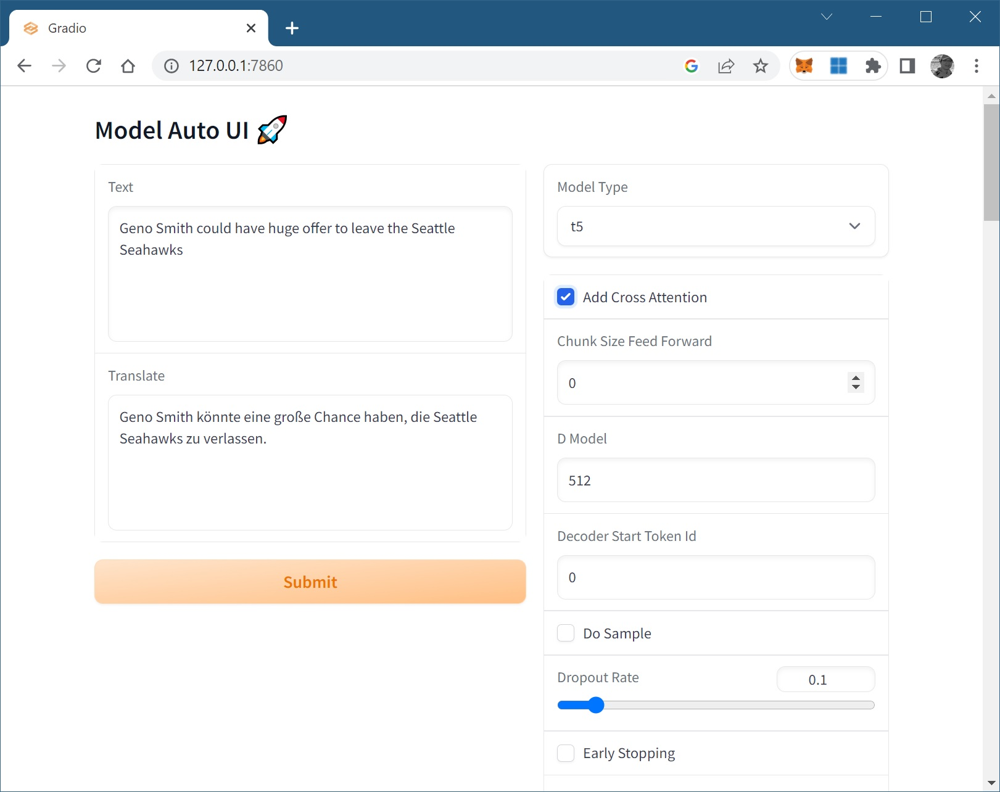
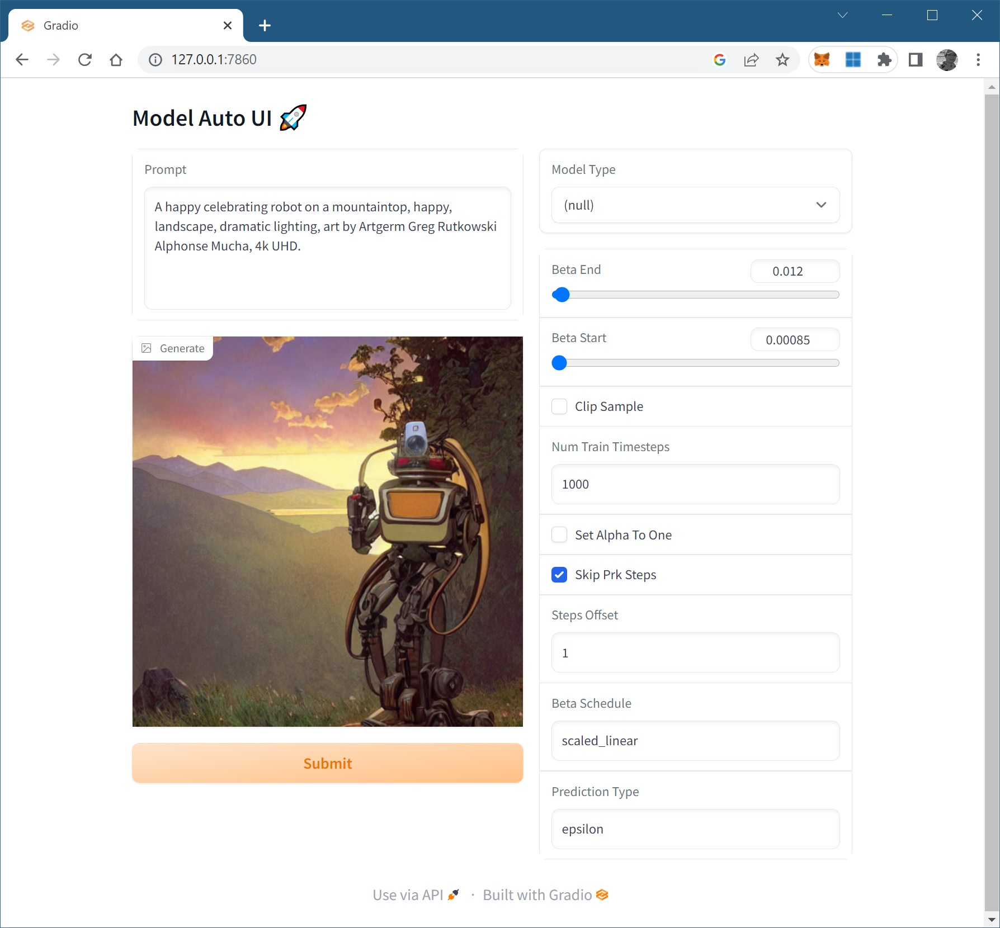

# Model Auto UI

Model Auto UI (`modui`) is a Python library that builds a Web UI page from a configuration via type inspection. It automatically updates the configuration whenever the corresponding UI widget is updated by the user. It then calls back to the specified user function whenever the Submit button on the generated page is clicked. The generated Web UI can be launched locally via a local web server or hosted temporarily in a public URL (handy for when it's run from a repl).

It can be used to locally test an ML model in Python, or to demo them to an interested party. Under the hood, it leverages Gradio for UI construction and web server integration.

This project is inspired by Nat Friedman's Replit Bounty [Playground for local models](https://replit.com/bounties/@natfriedman/openai-playground-fo). We'll try to stick with the feature set as envisioned by Nat, but may deviate when necessary.

## Sample

**Prerequisite**: Requires Gradio 3.16 and Python 3.7 or above.

### Hello, Transformers ⚡

To launch a UI for "T5-small", one of the HuggingFace Transformer models

1. Install Model Auto UI from pip. Note, the minimal supported Python version is 3.7.

```bash
pip install modui 
```

2. Run the code below as a Python script. Notice the first and the last line in the sample. Those are the two relevant lines, everything else in the middle is whatever code you're testing with. In this sample, it's the code necessary to run the "t5-small" model.

The `translate` function is the callback you give to Model Auto UI. It will be called when the Submit button on the generated page is clicked. 

The `model.config` is the model configuration with a bunch of properties. Each of these properties corresponds one-to-one to a UI widget on the page.

Lastly, the `launch` method launches the generated page in a local web server. 

```python
import modui

from transformers import T5Tokenizer, T5ForConditionalGeneration

tokenizer = T5Tokenizer.from_pretrained("t5-small")
model = T5ForConditionalGeneration.from_pretrained("t5-small")

def translate(text: str) -> str:
    input_ids = tokenizer(text, return_tensors="pt").input_ids
    outputs = model.generate(input_ids, max_new_tokens=512)
    return tokenizer.decode(outputs[0], skip_special_tokens=True)

modui.Page(fn=translate, config=model.config).launch()
```

3. This sample will launch a local web server serving the generated page on [http://localhost:7860](http://localhost:7860/). Setting the `share=True` parameter on the `launch()` call will temporarily host the URL in a public share, useful when the UI is launched from a remote machine e.g. when sharing out a UI to others or running it inside a Repl, etc. The following are some of the generated UI screens on the browser.




